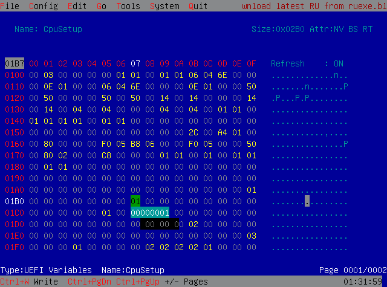
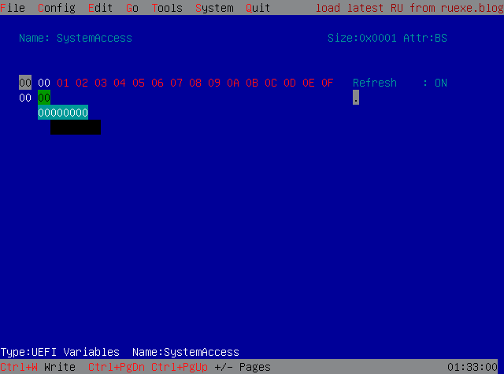
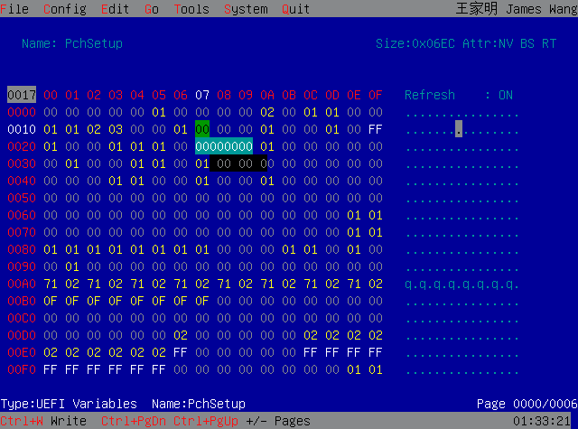
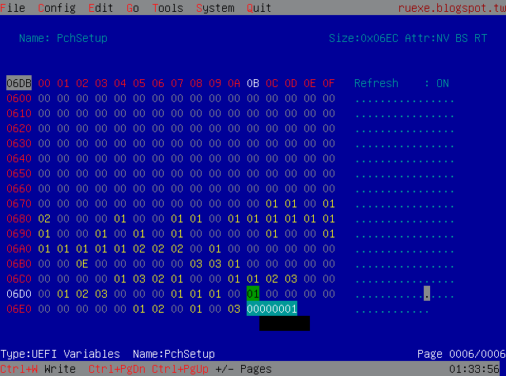
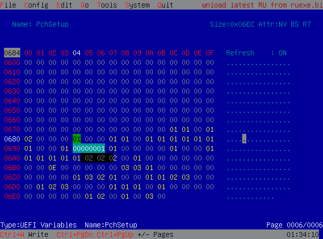
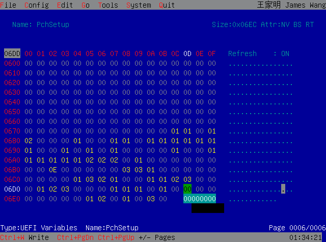
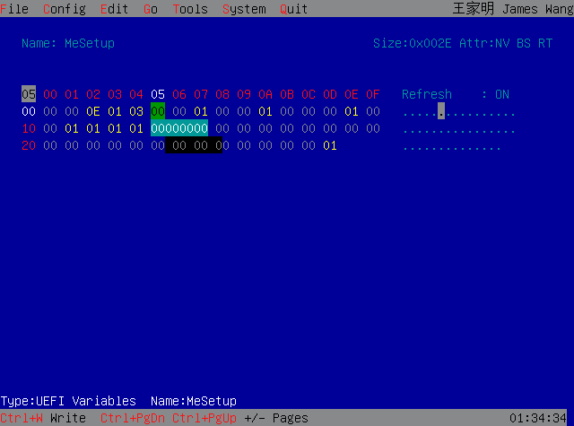
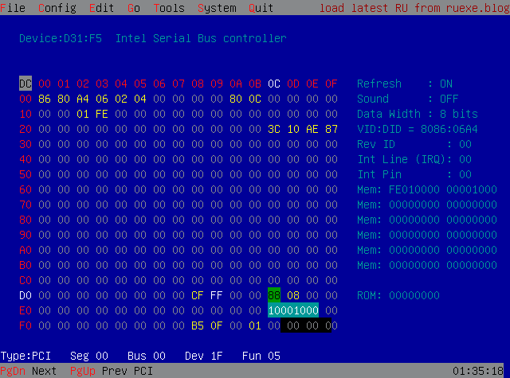

# Documentation: HP Pavilion BIOS Unlock Attempt

This document shows every detail, command, error, discovery, and attempt made to unlock the hidden Advanced BIOS settings on an HP Pavilion laptop running a Comet Lake platform. ps: it didnt work

---

## C1: System

### Target System Specifications

| Component | Details |
|-----------|---------|
| **Platform** | Intel Comet Lake (LPC Device ID: 68D) |
| **Flash Chip** | GigaDevice GD25B128C |
| **Flash Chip ID** | 0xC84018 |
| **Flash Size** | 16384KB (16MB / 131072Kb) |
| **BIOS Type** | AMI Aptio V UEFI with HP Customization Layer |
| **Intel ME Version** | 14.1, Build 2287, Hot Fix 72 |
| **Intel FITC Version** | 14.0.11.1205 | --> | same bios reflash updated to 14.1 |
| **BIOS Revision** | F.31 |

### Objective

To unhide the **Advanced** and **Chipset**  BIOS tabs to access:
- CPU Configuration
- Thermal Configuration
- Memory Configuration
- Overclocking Performance Menu
- Power & Performance settings
- Intel ICC settings
- Debug Settings
- Trusted Computing
- And other hidden AMI settings

---

## C2: Tools Used Throughout The Process

| Tool | Purpose |
|------|---------|
| **RU.EFI** | UEFI variable browser and editor |
| **FPTw64.exe** | Intel Flash Programming Tool (ME System Tools v14) |
| **UEFITool** | BIOS image analysis and module extraction |
| **IFR Extractor** | Extract human readable IFR from PE32 modules |
| **modGRUBShell** | Modified GRUB shell |
| **setup_var_cv** | Command to create/modify UEFI variables |
| **HP BCU** | HP BIOS Configuration Utility |
| **HxD** | Hex editor for binary patching |

---

## C3: BIOS Modifications Attempted

These changes I did before seeking help:

| Setting | Action Taken |
|---------|--------------|
| Overclocking Performance Menu | Enabled (not UI visible) |
| Overclocking Lock | Disabled |
| CFG Lock | Disabled |
| EC Turbo Control Mode | Disabled |
| Intel SpeedStep/SpeedShift | Enabled |
| BIOS Guard | Disabled |
| Advanced Setting | Set offset to 0x1 (no effect) |
| Audit Mode | Dunno tf is this |
| Setup Mode | Enabled just because |
| System Access | Attempted modification | Buggy works with same Boot Instance gone after reboot |
| Advanced Settings | Dont know what this is for i just enabled it |
| Bios Lock | Disabled |
| SPD Write Disable | Enabled |
| Flash Protection Range Registers (FPRR) | Disabled |
| ME FW Image Reflash | Enabled |
| Intel Serial Bus Controller | offset 0xDC = 88 (10001000) | Write protected |

**Result:** Shitshow.

---

## C4: Complete VarStore Definitions Extracted

Extracted the complete VarStore definitions from the Setup module:

### Primary VarStores

| VarStoreId | GUID | Size | Name |
|------------|------|------|------|
| 0x1 | EC87D643-EBA4-4BB5-A1E5-3F3E36B20DA9 | 0x179C | Setup |
| 0x2 | 8BE4DF61-93CA-11D2-AA0D-00E098032B8C | 0x2 | PlatformLang |
| 0x4 | E770BB69-BCB4-4D04-9E97-23FF9456FEAC | 0x1 | SystemAccess |
| 0x11 | B08F97FF-E6E8-4193-A997-5E9E9B0ADB32 | 0x2B0 | CpuSetup |
| 0x14 | 90D93E09-4E91-4B3D-8C77-C82FF10E3C81 | 0x7 | CpuSmm |
| 0x16 | 72C5E28C-7783-43A1-8767-FAD73FCCAFA4 | 0x21C | SaSetup |
| 0x17 | 4570B7F1-ADE8-4943-8DC3-406472842384 | 0x6EC | PchSetup |
| 0x18 | 5432122D-D034-49D2-A6DE-65A829EB4C74 | 0x2E | MeSetup |
| 0x45 | 0EE72C08-8185-427A-A58A-855B78B7BA0B | 0x1 | HpDynamicPageCount |
| 0x47 | B63BF800-F267-4F55-9217-E97FB3B69846 | 0x2 | DynamicPageCount |

### HP OEM VarStores (GUID: 0EE72C08-8185-427A-A58A-855B78B7BA0B)

Identified numerous HP-specific variables under this GUID:
- OEMDeviceStatus
- HideFccId
- NewSystemFamily
- HideBornOnDate
- HideGOPRevision
- GOPCount
- HideVBIOSRevision
- HidePDFwRevision
- HideTBTFwRevision
- HideRetimerFwRevision
- InternalDisallowTpmFlag
- DisableSGX
- ResetSecurityFlag
- PlatformKey
- PendingAction
- WindowsToGo
- MPMUnlock
- FixedBootNum
- UefiFixedBootNum
- HideCdromBootOption
- HideFanAlwaysOn
- HideSataEmulation
- MSFTDebugPolicy
- HpDynamicPageCount
- HideHT
- | And many more |

---

## C5: The Core Problem - Hardcoded Suppression

### IFR Structure Analysis

Extracted IFR section showing the menu suppression:

```
0x2AD0B: Form FormId: 0x2710, Title: "Setup"
0x2AD11:   Ref Prompt: "Main", FormId: 0x2711 (NOT suppressed - VISIBLE)

0x2AD20:   SuppressIf {0A 82}
0x2AD22:     True {46 02}                    ← HARDCODED TRUE
0x2AD24:     Ref Prompt: "Advanced", FormId: 0x2712
0x2AD33:   End {29 02}

0x2AD35:   SuppressIf {0A 82}
0x2AD37:     True {46 02}                    ← HARDCODED TRUE
0x2AD39:     Ref Prompt: "Chipset", FormId: 0x2713
0x2AD48:   End {29 02}

0x2AD4A:   SuppressIf {0A 82}
0x2AD4C:     True {46 02}                    ← HARDCODED TRUE
0x2AD4E:     Ref Prompt: "Security", FormId: 0x2714
0x2AD5D:   End {29 02}

0x2AD5F:   Ref Prompt: "Boot", FormId: 0x2715 (NOT suppressed - VISIBLE)
0x2AD6E:   Ref Prompt: "Save & Exit", FormId: 0x2716 (NOT suppressed - VISIBLE)
```

### The Opcode Explanation

| Opcode | Hex | Meaning |
|--------|-----|---------|
| SuppressIf | 0A 82 | Begin conditional suppression block |
| True | **46 02** | Boolean constant TRUE (always suppress) | -- Advanced Settings |
| False | **47 02** | Boolean constant FALSE (never suppress) |
| End | 29 02 | End of block |

**F HP:** The suppression is NOT based on any variable check. It's a hardcoded constant.

---

## C6: The Advanced Form Contents (Hidden)

The juicy part HP trying to hide  (Fprmid: 0x2712) have :

```
Form FormId: 0x2712, Title: "Advanced"
├── RC ACPI Settings (FormId: 0x271E)
├── Connectivity Configuration (FormId: 0x2722)
├── CPU Configuration (FormId: 0x273F)
├── Power & Performance (FormId: 0x2742)
├── PCH-FW Configuration (FormId: 0x2785)
├── Thermal Configuration (FormId: 0x278C)
├── Platform Settings (FormId: 0x2791) [conditionally suppressed]
├── ACPI D3Cold settings (FormId: 0x2792)
├── OverClocking Performance Menu (FormId: 0x27AA)
├── AMT Configuration (FormId: 0x27B5)
├── Intel ICC (FormId: 0x27BF)
├── Debug Settings (FormId: 0x27C1)
├── Trusted Computing (FormId: 0x27C5/C6/C7) [conditionally suppressed]
├── ACPI Settings (FormId: 0x27C8)
├── SMART Settings (FormId: 0x27E4)
├── Intel TXT Information (FormId: 0x27E8)
├── Acoustic Management Configuration
├── Switchable Graphics (FormId: 0x27EA)
├── AMI Graphic Output Protocol Policy (FormId: 0x27ED)
├── SIO Common Setting (FormId: 0x27F9)
├── SIO Configuration
├── PCI Subsystem Settings
├── USB Configuration (FormId: 0x27FE)
├── Network Stack Configuration (FormId: 0x2801)
├── NVMe Configuration
└── Driver Health (FormId: 0x2A01)
```

---

## C7: The DynamicPageCount Discovery

### The Backdoor I Thought I Got

Somehow discovered a variable-based suppression that COULD work:

```
0x2B27E: SuppressIf {0A 82}
0x2B280:   EqIdValList QuestionId: 0xD55, Values: 
0x2B288:   Ref Prompt: "", FormId: 0x2712
0x2B297: End {29 02}
```

**Means:** If `DynamicPageCount` equals 0xFFFF (65535), suppress this reference.

### The Variable Chain

```
QuestionId: 0xD55 → VarStore: 0x47 → DynamicPageCount
GUID: B63BF800-F267-4F55-9217-E97FB3B69846
Offset: 0x0
Size: 2 bytes
```

### The UEFI HII Configuration Menu

```
0x4F8C5: SuppressIf {0A 82}
0x4F8C5:   QuestionId: 0xD56 equals value 0x0
0x4F8CB:   Ref: UEFI HII Configuration, FormId: 0x29F4
0x4F8DA: End {29 02}
```

**Translation:** If `HpDynamicPageCount` equals 0x0, suppress UEFI HII Configuration menu.

| Variable | Condition | Result |
|----------|-----------|--------|
| HpDynamicPageCount = 0x00 | True | Menu hidden |
| HpDynamicPageCount ≠ 0x00 | False | Menu visible |

---

## C8: Complete UEFI Variable Dump

Dumped all existing NVRAM variables. 
 findings:
```
Name: DeploymentModeNv
GUID: 97e8965f-c761-4f48-b6e4-9ffa9cb2a2d6
Name: FeatureByteFlag
GUID: 0ee72c08-8185-427a-a58a-855b78b7ba0b
Name: CleanNvram
GUID: 0ee72c08-8185-427a-a58a-855b78b7ba0b
Name: FactoryCmdData
GUID: 0ee72c08-8185-427a-a58a-855b78b7ba0b
Name: FactoryCmdStatus
GUID: 0ee72c08-8185-427a-a58a-855b78b7ba0b
Name: HPAmiTse
GUID: 206bc44a-c8a7-4000-896f-0da25fb37702
Name: MonotonicCounter
GUID: 01368881-c4ad-4b1d-b631-d57a8ec8db6b
Name: TpmOldvar
GUID: 135902e7-9709-4b41-8fd2-4069daf0546a
Name: PendingAction
GUID: 0ee72c08-8185-427a-a58a-855b78b7ba0b

 ... and many more in All_variables.txt

```
## Phantom Variables

| Variable | Expected GUID | Status |
|----------|---------------|--------|
| **DynamicPageCount** | B63BF800-F267-4F55-9217-E97FB3B69846 | **NOT PRESENT** |
| **HpDynamicPageCount** | 0EE72C08-8185-427A-A58A-855B78B7BA0B | **NOT PRESENT** |

**Not in NVRAM:** The variables that control menu visibility were **never initialized** by HP's factory firmware. They exist in IFR definitions but not in actual NVRAM.

---

## C9: HP BCU Output

HP BIOS Configuration Utility:

```
Speaker ID: 1
PIN Process Cycle: 20C1
Language: *English, Francais, Espanol, Traditional Chinese, Simplified Chinese
Fan Always On: Disable, *Enable
Action Keys Mode: *Disable, Enable
Adaptive Battery Extender: *Disable, Enable
Adaptive Battery Extender Status: *Not Activated, Activated
POST Hotkey Delay (sec): *0, 5, 10, 15, 20
USB Boot: Disable, *Enable
Network Boot: Disable, *Enable
Network Boot Protocol: IPv4 (UEFI), IPv6 (UEFI), *IPv4+IPv6 (UEFI)
Secure Boot: *Disable, Enable
UEFI Boot Order: OS Boot Manager, USB Flash Drive/USB Hard Disk, USB CD/DVD ROM Drive, Network Adapter
TPM Device: *Hidden, Available
TPM State: *Disable, Enable
Clear TPM: *No, Yes
Manufacturing Programming Mode: Lock, *Unlock    ← CRITICAL: MPM IS UNLOCKED
TPM Reset to Factory Defaults: *No, Yes
TPM Activation Policy: *No prompts, Allow user to reject
Restore Security Defaults: *No, Yes
TPM version: d1.2, d2.0, *f2.0
Secure Boot Keys: *Clear, HP, MSFT, Custom
PIN Load Defaults: *No, Yes
Clear BOD: *No, Yes
Reflow Process: *No, Yes
Hyper-Threading: Disabled, *Enabled
BIOS Revision: F.31
```

**MPMUNLOCK** Manufacturing Programming Mode (MPM) is **(0x1)** .

---

## C10: Variable Modification Attempts

### Attempt 1: SystemAccess Variable

| Action | Result |
|--------|--------|
| Set SystemAccess from 0x00 to 0x01 | Works |
| Reboot | **Reverted to 0x00** |

### Attempt 2: FactoryCmdData Variable

| Action | Result |
|--------|--------|
| Attempt to modify | **Reverted** |

### Attempt 3: DynamicPageCount / HpDynamicPageCount

| Action | Result |
|--------|--------|
| Search in RU.EFI | **Not found** |
| Search by GUID | **GUID not present** |
| Use setup_var_cv to create | **Failed - "Looking for..."** |
| Reason | Variables never initialized; cannot create new protected variables |

### Variables That DID Survived Reboot

| Variable | Change | Status |
|----------|--------|--------|
| CFG Lock | Disabled | **survived Reboot**  |
| Overclocking settings | Modified | **survived Reboot**  |
| BIOS Guard | Disabled | **Off by default**  |
| BIOS Lock | Set to 0x00 | **survived Reboot**  |
| FPRR | Set to 0x00 | **Off by default**  |
| Overclocking performance Bit | Enabled | **survived Reboot** |
| Advanced Settings | Enabled | **survived Reboot** |
| System Access | Enabled | **Resets at reboot** |
| ME FW Image Reflash | Enabled | **Resets at reboot** |

---

## C11: Flash Protection Settings

Settings in the IFR:

### FPRR (Flash Protection Range Registers)

```
OneOf Prompt: "Flash Protection Range Registers (FPRR)"
VarStoreInfo: VarOffset 0x6DD, VarStore: 0x17 (PchSetup)
QuestionId: 0x6D5, Size: 1
Options: Disabled (0x0, default), Enabled (0x1)
```

### BIOS Lock

```
OneOf Prompt: "BIOS Lock"
VarStoreInfo: VarOffset 0x17, VarStore: 0x17 (PchSetup)
QuestionId: 0xBE0, Size: 1
Options: Disabled (0x0, default MFG), Enabled (0x1)
Default: 0x1 (Enabled)
```

### Settings Status in NVRAM

| Setting | Offset in PchSetup | Value Set | Actual Effect |
|---------|-------------------|-----------|---------------|
| BIOS Guard | 0xDB | 0x00 | Disabled |
| BIOS Lock | 0x17 | 0x00 | MfGDefault disabled |
| FPRR | 0x6DD | 0x00 | MfGDefault disabled |

---

## C12: FPT Flash Attempts

### FPT Information Output

```
Intel (R) Flash Programming Tool Version: 14.0.11.1205
Copyright (C) 2005 - 2019, Intel Corporation. All rights reserved.

Reading HSFSTS register... Flash Descriptor: Valid

--- Flash Devices Found ---
GD25B128C    ID:0xC84018    Size: 16384KB (131072Kb)

--- Flash Image Information --
Signature: VALID
Number of Flash Components: 1
    Component 1 - 16384KB (131072Kb)
Regions:
    DESC     - Base: 0x00000000, Limit: 0x00000FFF
    BIOS     - Base: 0x00380000, Limit: 0x00FFFFFF
    CSME     - Base: 0x00001000, Limit: 0x0037FFFF
    GbE      - NOT PRESENT
    PDR      - NOT PRESENT
    EC       - NOT PRESENT
Master Region Access:
    BIOS     - ID: Read: 0x000F, Write: 0x000A
    CSME     - ID: Read: 0x000D, Write: 0x0004

Total Accessible SPI Memory: 16384KB, Total Installed SPI Memory: 16384KB
```

### FPT Dump Command

```cmd
fptw64.exe -bios -d backup.bin
```

**Result:** SUCCESS - BIOS region dumped successfully.

### FPT Write Attempt

```cmd
fptw64.exe -bios -f backup.bin
```

**Result:** FAILURE

### First Error Output

```
FPRval  0x870FF848
BIOS space write protection is Disabled
Flash protection range is enabled

Error 167: Protected Range Registers are currently set by BIOS, preventing flash access.
Please contact the target system BIOS vendor for an option to disable
Protected Range Registers.

FPT Operation Failed.
```

### Second Error Output (After BIOS Update)

```
FPRval  0xEC7AF998
BIOS space write protection is Enabled
BIOS space write protection is Disabled
Flash protection range is enabled

Error 167: Protected Range Registers are currently set by BIOS, preventing flash access.

After this it Become Glitchy idk what else to say

    --- Flash Devices Found ---
    GD25B128C    ID:0xC84018    Size: 16384KB (131072Kb)

Using hardware sequencing.
Reading region information from flash descriptor.
Base: 0x00000000, Limit: 0x00000FFF
Base: 0x00380000, Limit: 0x00FFFFFF
Base: 0x00001000, Limit: 0x0037FFFF
FPRval  0x4ABBF708
BIOS space write protection is Disabled
Flash protection range is enabled

Error 167: Protected Range Registers are currently set by BIOS, preventing flash access.
Please contact the target system BIOS vendor for an option to disable
Protected Range Registers.

FPT Operation Failed.

    --- Flash Devices Found ---
    GD25B128C    ID:0xC84018    Size: 16384KB (131072Kb)

Using hardware sequencing.
Reading region information from flash descriptor.
Base: 0x00000000, Limit: 0x00000FFF
Base: 0x00380000, Limit: 0x00FFFFFF
Base: 0x00001000, Limit: 0x0037FFFF
FPRval  0xF1CFFC18
BIOS space write protection is Enabled
BIOS space write protection is Disabled
Flash protection range is enabled

Error 167: Protected Range Registers are currently set by BIOS, preventing flash access.
Please contact the target system BIOS vendor for an option to disable
Protected Range Registers.

FPT Operation Failed.

ALL of these are done in same instance of powershell without reboot or sleep

```

### Geeked out Me Explained

The NVRAM variables showed `BIOS Lock = 0x00` and `FPRR = 0x00`, yet PRR was still enabled. The reason: HP's compiled firmware code sets the Protected Range Registers **before** NVRAM variables are read. The variables are **placeholders** that HP's initialization code ignores. as its **0x88** as shown before.

---

## C13: HiiDB Investigation

`HiiDB` in the NVRAM variable list:

```
Name: HiiDB
GUID: 1b838190-4625-4ead-abc9-cd5e6af18fe0

Useless has nothing range is only till 07 very short useless.
```

### Examination in RU.EFI

HiiDB variable was Very useless (only ~7 bytes visible):

```
00 00 01 02 03 04 05 06 07 08
00 D4 11 12 00 00 00 7D 55

```
---

## C14: SMM and Related Settings Search

Searched IFR for SMM-related settings that might affect flash protection:

### CPU SMM Enhancement Form (FormId: 0x2741)

```
Form: CPU SMM Enhancement
├── SMM MSR Save State Enable (VarStore: 0x14, Offset: 0x0)
│   └── Suppressed if QuestionId 0xE57 = 0
├── SMM Code Access Check (VarStore: 0x14, Offset: 0x1)
│   └── Suppressed with hardcoded True {46 02}
├── SMM Use Delay Indication (VarStore: 0x14, Offset: 0x2)
├── SMM Use Block Indication (VarStore: 0x14, Offset: 0x3)
├── SMM Use SMM en-US Indication (VarStore: 0x14, Offset: 0x4)
└── SMM Processor Trace (VarStore: 0x14, Offset: 0x5)
```

**VarStore 0x14 = CpuSmm** (GUID: 90D93E09-4E91-4B3D-8C77-C82FF10E3C81, Size: 0x7)

### PSMI Support

```
OneOf Prompt: "PSMI SUPPORT"
VarStoreInfo: VarOffset 0x45, VarStore: 0x16 (SaSetup)
Options: Disabled (0x0, default), Enabled (0x1)
```

**Conclusion:** These are CPU SMM behavior settings, NOT SPI flash protection settings. They cannot help bypass Error 167. -- THX AI

---

## C15: Other Settings Investigated

### Settings Found But Unrelated to Flash Protection

| Setting | Purpose |
|---------|---------|
| PMIC Flash Panel | Camera flash LED power management |
| WLED1/WLED2 Flash Max Current | LED brightness for camera flash |
| Flash Support | Camera flash driver settings |
| PEP SPI | Power Engine Plugin for SPI (power management, not protection) |
| ISH GPIO SPI | Intel Sensor Hub GPIO assignment |
| SPD Write | Memory SPD EEPROM write protection |

---

## C16: The Complete Protection Stack

### Layer 1: UI Suppression (Hardcoded)

| Menu | Suppression Type | Bypassable via Variables? |
|------|------------------|---------------------------|
| Advanced | SuppressIf: True {46 02} | **NO** |
| Chipset | SuppressIf: True {46 02} | **NO** |
| Security | SuppressIf: True {46 02} | **NO** |

### Layer 2: Variable Non-Existence

| Variable | Status | Impact |
|----------|--------|--------|
| DynamicPageCount | Does not exist | Cannot toggle alternate path |
| HpDynamicPageCount | Does not exist | Cannot show UEFI HII Config |
| SystemAccess | Does not exist / reverts | Cannot elevate access |

### Layer 3: Sure Start Protection

| Variable | Behavior |
|----------|----------|
| SystemAccess | Reverts on reboot |
| FactoryCmdData | Protected/reverts |

### Layer 4: Flash Write Protection (PRR)

| Protection | NVRAM Setting | Actual State |
|------------|---------------|--------------|
| BIOS Lock | 0x00 (Disabled) | Ignored by firmware |
| FPRR | 0x00 (Disabled) | Ignored by firmware |
| BIOS Guard | 0x00 (Disabled) | Possibly effective |
| PRR Hardware | N/A | SET by compiled code |

**FPT Error 167:** Protected Range Registers are set by BIOS initialization code BEFORE NVRAM variables are read.

---

## C17: The Binary Patch Solution

### Patch Locations Identified

| Menu | IFR Offset | Hex Pattern to Find | Change |
|------|------------|---------------------|--------|
| Advanced | 0x2AD22 | `0A 82 46 02 0F 0F 1E 00` | `46` → `47` |
| Chipset | 0x2AD37 | `0A 82 46 02 0F 0F 1F 00` | `46` → `47` |
| Security | 0x2AD4C | `0A 82 46 02 0F 0F 39 00` | `46` → `47` |

### Patch Effect

| Before | After |
|--------|-------|
| SuppressIf: **True** | SuppressIf: **False** |
| Menu hidden always | Menu visible always |

---

## C18: Current System State Summary

| Attribute | Status |
|-----------|--------|
| **Platform** | Intel Comet Lake |
| **Flash Chip** | GD25B128C (16MB) |
| **MPM Status** | **UNLOCKED** (0x1) |
| **BIOS Lock NVRAM** | 0x00 (Disabled) |
| **FPRR NVRAM** | 0x00 (Disabled) |
| **BIOS Guard NVRAM** | 0x00 (Disabled) |
| **CFG Lock** | Disabled (survives reboot) |
| **Overclocking** | Settings modified (survives reboot) |
| **DynamicPageCount** | Does not exist |
| **HpDynamicPageCount** | Does not exist |
| **FPT Write** | **BLOCKED** (Error 167) |
| **Advanced Tab** | **HIDDEN** (hardcoded True) |
| **Chipset Tab** | **HIDDEN** (hardcoded True) |
| **Security Tab (Full)** | **HIDDEN** (hardcoded True) |

---

## C19: Varoffsets and varstore Ids:

|          Name                         | VarOffset | VarstoreId |  Variable Names       |
|---------------------------------------|-----------|------------|----------------------|
| **OverClocking performance Bit**      | 0x1B7     | 0x11       |  CpuSetup            |
| **OverClocking Lock**                 | 0xDA      | 0x11       |  CpuSetup            |
| **CFG Lock**                          | 0x3E      | 0x11       |  CpuSetup            |
| **Bios Guard**                        | 0xDB      | 0x11       |  CpuSetup            |
| **Advanced settings**                 | 0x443     | 0x1        |  Setup               |
|                                       |           | 0x2A       |  SystemAccess        |
| **Bios Lock**                         | 0x17      | 0x17       |  PCH Setup           |
| **SPD Write Disable**                 | 0x6DB     | 0x17       |  PCH Setup           |
| **Flash Protection Range Registers**  | 0x6DD     | 0x17       |  PCH Setup           |
| **ME FW Image Reflash**               | 0x5       | 0x18       |  ME Setup            |

---

### GUIDs Referenced

| GUID | Name |
|------|------|
| 7B59104A-C00D-4158-87FF-F04D6396A915 | Setup FormSet / SecureBootSetup |
| EC87D643-EBA4-4BB5-A1E5-3F3E36B20DA9 | Setup VarStore |
| B63BF800-F267-4F55-9217-E97FB3B69846 | DynamicPageCount |
| 0EE72C08-8185-427A-A58A-855B78B7BA0B | HP OEM Variables |
| 4570B7F1-ADE8-4943-8DC3-406472842384 | PchSetup |
| B08F97FF-E6E8-4193-A997-5E9E9B0ADB32 | CpuSetup |
| 72C5E28C-7783-43A1-8767-FAD73FCCAFA4 | SaSetup |
| E770BB69-BCB4-4D04-9E97-23FF9456FEAC | SystemAccess |
| 206BC44A-C8A7-4000-896F-0DA25FB37702 | HPSetupData / HPAmiTse |

---

## TL:DR

1. Extracting and analyzing complete IFR dumps
2. Identifying the exact suppression mechanism
3. Mapping all relevant VarStores and offsets
4. Attempting every known variable modification technique
5. Investigating FPT flash capabilities and limitations
6. Used a tool UEFIVAR from zibri(virustotal 5/65) seems like malware might be wrong 
    [zibri - its just statistics nothing malicious when users complained i hope so]

**Final Status:** F HP

**Future Goal**
1. Pin mod (REALTEK - ALC 3315)
2. Programmer flash


**Screenshots**
 #### xtu


 #### fivr
 

 #### RU.EFI
 

 

 

 

 

 

 

 

 
 
 

 

 
